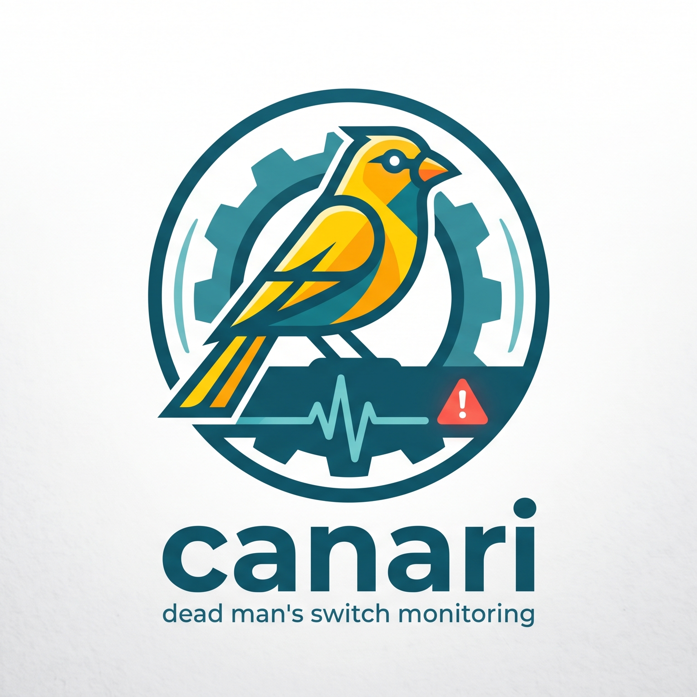

<p align="center">
  
</p>

# canari

Monitoring de type « dead man's switch » pour cron jobs et services de fond :
un job qui **cesse** de pinguer déclenche une alerte. Clone minimal de
[healthchecks](https://github.com/healthchecks/healthchecks), écrit en Rust,
livré en **un seul binaire** — SQLite, templates, CSS et logo sont compilés
dedans. Aucune dépendance externe, aucun runtime à installer.

```
canari 0.1.0 · ~9 Mo · SQLite embarqué · webhook + ntfy · API REST · badges SVG
```

## Démarrage

Chaque tag `vX.Y` publie des binaires dans les
[releases](../../releases) : Linux musl statique (x86_64 et aarch64) et macOS
(Apple Silicon et Intel).

```sh
tar xzf canari-v0.1-x86_64-unknown-linux-musl.tar.gz
cd canari-v0.1-x86_64-unknown-linux-musl
```

Ou depuis les sources :

```sh
cargo build --release
```

Puis, dans les deux cas :

```sh
./canari admin set-password        # demande le mot de passe
./canari --site-url https://canari.example.org
```

Puis <http://127.0.0.1:8000>. Tant qu'aucun mot de passe n'est défini, l'UI
refuse de servir quoi que ce soit plutôt que d'exposer une administration
ouverte.

### Configuration

| Option | Variable | Défaut |
| --- | --- | --- |
| `--db` | `CANARI_DB` | `canari.db` |
| `--listen` | `CANARI_LISTEN` | `127.0.0.1:8000` |
| `--site-url` | `CANARI_SITE_URL` | `http://localhost:8000` |

`site-url` sert à construire les URL de ping et de badge affichées : c'est
l'adresse publique de l'instance. Verbosité : `CANARI_LOG=canari=debug`
(syntaxe `tracing`/`RUST_LOG`).

## Utilisation

### Créer un check

```sh
canari check add "sauvegarde nuit" --period 1d --grace 2h
canari check add "rapport" --cron "*/15 * * * *" --tz Europe/Paris --grace 5m
```

`--period` accepte `30s`, `5m`, `1h30m`, `2d`. Un check « cron » attend un ping
après chaque occurrence de l'expression, évaluée dans sa timezone.

### Pinguer

```sh
curl https://canari.example.org/ping/<uuid>            # succès
curl https://canari.example.org/ping/<uuid>/start      # début d'exécution
curl https://canari.example.org/ping/<uuid>/fail       # échec explicite
curl https://canari.example.org/ping/<uuid>/42         # code de sortie
curl https://canari.example.org/ping/<uuid>/log        # trace sans changer l'état
```

N'importe quelle méthode HTTP fonctionne. Le corps d'un POST est conservé
(tronqué à 100 Kio) et visible dans le journal des pings — pratique pour y
verser la sortie du job. Encadrer un job donne aussi sa durée d'exécution :

```sh
curl -fsS https://canari.example.org/ping/<uuid>/start
/usr/local/bin/backup.sh 2>&1 | tail -c 10000 | curl -fsS --data-binary @- \
  "https://canari.example.org/ping/<uuid>/$?"
```

### États

`new` → jamais pingué · `up` → à l'heure · `grace` → en retard, dans la période
de grâce · `down` → grâce épuisée, alerte envoyée · `paused` → surveillance
suspendue.

Une alerte part sur `up|grace → down` et une notification de rétablissement sur
`down → up`, une seule fois par transition.

### Canaux de notification

```sh
canari channel add-ntfy "téléphone" --topic mes-alertes
canari channel add-webhook "slack" --url https://hooks.slack.com/... \
  --body '{"text": $MESSAGE_JSON}'
canari channel test 1
canari check attach <uuid> 1
```

Le payload webhook par défaut est un JSON construit par sérialisation (aucun nom
de check ne peut le casser). Un gabarit personnalisé dispose de `$NAME`,
`$STATUS`, `$UUID`, `$TAGS`, `$URL`, `$TITLE`, `$MESSAGE`, `$NOW`, et des
variantes échappées `$NAME_JSON`, `$TITLE_JSON`, `$MESSAGE_JSON`.

Les erreurs transitoires (réseau, 5xx, 429, 408) sont réessayées trois fois ;
une 4xx est définitive. Chaque tentative est journalisée en base.

### API REST

```sh
canari admin key-new "ci"                 # clé lecture/écriture
canari admin key-new "statut" --read-only # GET uniquement

curl -H "X-Api-Key: ck_..." https://canari.example.org/api/v1/checks
```

| Méthode | Route |
| --- | --- |
| GET / POST | `/api/v1/checks` |
| GET / POST / DELETE | `/api/v1/checks/{uuid}` |
| POST | `/api/v1/checks/{uuid}/pause`, `/resume` |
| GET | `/api/v1/checks/{uuid}/pings` |
| GET | `/api/v1/channels` |
| DELETE | `/api/v1/keys/{id}` |

Seul le SHA-256 des clés est stocké : une clé perdue se révoque, elle ne se
retrouve pas.

### Badges

Chaque check expose `/badge/<badge_token>.svg`. Le token est distinct de l'uuid
de ping — un badge finit dans un README public, l'uuid autorise les pings.

## Déploiement

### systemd

```sh
useradd --system --no-create-home canari
install -m755 target/release/canari /usr/local/bin/canari
install -m644 deploy/canari.service /etc/systemd/system/
# ajuster CANARI_SITE_URL dans l'unité
systemctl enable --now canari
sudo -u canari CANARI_DB=/var/lib/canari/canari.db canari admin set-password
```

L'unité fournie tourne sans privilèges, avec `ProtectSystem=strict` et un
`SystemCallFilter`. Mettre un reverse proxy devant pour TLS :

```caddy
canari.example.org {
    reverse_proxy 127.0.0.1:8000
}
```

`X-Forwarded-For` est utilisé pour afficher l'IP source des pings.

### Docker

```sh
docker build -t canari .
docker run -d -p 8000:8000 -v canari-data:/data \
  -e CANARI_SITE_URL=https://canari.example.org canari
docker exec -it <id> canari admin set-password
```

### Compilation croisée

Les workflows GitHub s'en chargent à chaque tag `vX.Y`. En local, zig sert à la
fois de compilateur C (pour le SQLite embarqué) et de linker :

```sh
brew install rustup zig                 # ou l'équivalent de la distribution
rustup target add x86_64-unknown-linux-musl
cargo install cargo-zigbuild
cargo zigbuild --release --target x86_64-unknown-linux-musl
```

Le binaire obtenu est statique : `ELF 64-bit LSB executable, x86-64, statically
linked, stripped`, ~10 Mo.

### Sauvegarde

Tout tient dans un fichier SQLite :

```sh
sqlite3 /var/lib/canari/canari.db ".backup /backups/canari-$(date +%F).db"
```

## Notes de conception

- **Horodatages** : entiers, epoch UTC — les comparaisons `alert_after <= now`
  restent exactes et indexables.
- **`checks.alert_after`** marque le début de la période de grâce ; la bascule
  en `down` se calcule avec `grace_s`, déjà présent dans la ligne. Deux seuils
  sans colonne supplémentaire.
- **La boucle d'alerte** (10 s) ne scanne que `alert_after`, via un index
  partiel sur les statuts `up`/`grace`. L'UPDATE de transition est conditionné
  au couple `(status, alert_after)` lu au SELECT : un ping arrivant entre les
  deux annule la bascule au lieu de déclencher une fausse alerte.
- **Les notifications sont détachées** : ni la boucle d'alerte ni la réponse à
  un ping n'attend le endpoint d'un tiers.
- **SQLite** en WAL avec `busy_timeout` : les lectures ne bloquent pas, les
  écritures concurrentes s'attendent au lieu d'échouer en `SQLITE_BUSY`.
- **`paused` est un statut**, pas un drapeau : un check en pause sort
  naturellement de la requête d'alerte.
- **Session** : cookie `SameSite=Lax` (ce qui bloque les POST forgés
  cross-site), jeton stocké haché, `Secure` posé seulement si `site-url` est en
  https — sinon une installation locale en http perdrait le cookie.
- **TLS sortant** : rustls adossé à `ring`, pour que la compilation statique
  musl ne réclame ni cmake ni toolchain C.

## Ce qui n'est pas là

Multi-utilisateur et projets, SSO, e-mail/SMTP, transports type PagerDuty ou
Opsgenie, rapports périodiques, badges par tag, purge configurable de
l'historique. Les pings sont conservés à 100 par check.
